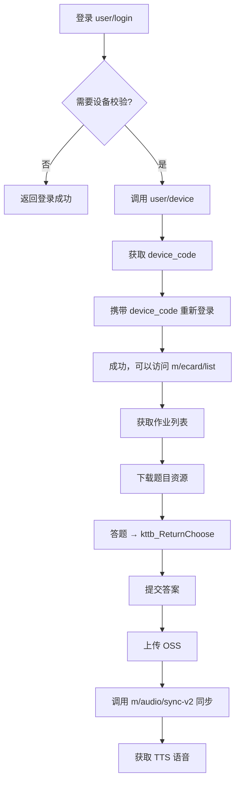

# ETS 自动答题工具 — 深度竞品分析报告

> 更新时间：2026-05-12 22:10
> 分析范围：GitHub + 52pojie 公开发布项目
> 分析深度：源码级实现原理

---

## 一、全景概览

目前已发现 **8 个 PC 端项目 + 1 个 Android 端深度研究**，技术路线覆盖从底层 DLL 注入到上层图像识别。

```
技术暴力程度：越左越暴力（底层），越右越温和（上层）

DLL 注入          CDP+DOM 注入       本地答案解析        图像识别
ETSToolbox       ETS_Auto           ECRACK             AutoETS
etsTool（复刻）                        extract-ets-lib
                                      ETS_ANSWER_GETTER
                                      Auto-ETS-Homework
```

---

## 二、深度技术分析

### 🔴 2.1 ETSToolbox — DLL 注入 + Detours Hook

#### 核心原理

ETSToolbox 使用 **DLL 劫持 + API Hook** 技术，将恶意 DLL 注入到 ETS 客户端进程中，通过 Hook 关键函数实现改分改时间。

#### 实现细节

**Step 1: DLL 劫持**

使用 [AheadLib](https://github.com/strivexjun/AheadLib-x86-x64) 工具生成 `winmm.dll` 劫持桩：

```cpp
// dllmain.cpp (generated by AheadLib)
#pragma comment(linker, "/EXPORT:mciExecute=_AheadLib_mciExecute,@3")
#pragma comment(linker, "/EXPORT:CloseDriver=_AheadLib_CloseDriver,@4")
#pragma comment(linker, "/EXPORT:DefDriverProc=_AheadLib_DefDriverProc,@5")
// ... 导出 winmm.dll 所有函数

HMODULE g_hModule = NULL;
FARPROC g_ProxyFunctions[256] = {0};

BOOL APIENTRY DllMain(HMODULE hModule, DWORD dwReason, LPVOID lpReserved) {
    if (dwReason == DLL_PROCESS_ATTACH) {
        g_hModule = hModule;
        // 加载真正的 winmm.dll
        HMODULE hOrig = LoadLibraryA("C:\\Windows\\System32\\winmm.dll");
        // 获取所有原始函数地址
        for (int i = 0; i < 256; i++) {
            g_ProxyFunctions[i] = GetProcAddress(hOrig, EXPORT_NAMES[i]);
        }
        // 初始化 Hook
        InitHooks();
    }
    return TRUE;
}
```

**Step 2: Detours Hook**

使用 Microsoft Detours 库 Hook 目标函数：

```cpp
#include <detours.h>

// 原始函数指针
static BOOL (WINAPI *TrueGetClientRect)(HWND, LPRECT) = GetClientRect;

// Hook 函数
BOOL WINAPI HookedGetClientRect(HWND hWnd, LPRECT lpRect) {
    BOOL result = TrueGetClientRect(hWnd, lpRect);
    if (IsETSWindow(hWnd)) {
        // 修改窗口大小，注入控制面板
        lpRect->right -= 300;  // 留出侧边栏空间
    }
    return result;
}

void InitHooks() {
    DetourTransactionBegin();
    DetourUpdateThread(GetCurrentThread());
    DetourAttach(&(PVOID&)TrueGetClientRect, HookedGetClientRect);
    DetourTransactionCommit();
}
```

**Step 3: 内存修改**

Hook 后直接操作 ETS 进程内存：

```cpp
// 改分逻辑（伪代码）
void ModifyScore(int newScore) {
    DWORD baseAddr = GetModuleBase("ETSShell.exe");
    DWORD scoreOffset = 0x123456;  // 通过逆向找到的偏移
    DWORD scoreAddr = baseAddr + scoreOffset;
    
    // 修改内存保护
    DWORD oldProtect;
    VirtualProtect((LPVOID)scoreAddr, 4, PAGE_EXECUTE_READWRITE, &oldProtect);
    
    // 写入新分数
    *(int*)scoreAddr = newScore;
    
    VirtualProtect((LPVOID)scoreAddr, 4, oldProtect, &oldProtect);
}
```

**Step 4: 前后端分离**

ETSToolbox 采用前后端分离架构：
- 后端：C++ DLL 注入到 ETS 进程，提供改分/改时间 API
- 前端：ETSToolbox-js（独立仓库），通过 WebSocket 与后端通信

前端仓库地址：https://github.com/Howie114514/ETSToolbox-js

#### 技术栈

| 组件 | 技术 |
|---|---|
| DLL 劫持 | AheadLib |
| API Hook | Microsoft Detours |
| 前后端通信 | WebSocket |
| 构建工具 | CMake + vcpkg |

#### 局限性

- ❌ 需要手动复制 DLL 到 ETS 安装目录
- ❌ 需要管理员权限
- ❌ 可能被杀毒软件拦截
- ❌ 改分逻辑依赖硬编码偏移，ETS 更新后失效
- ❌ 有法律风险（篡改客户端）

---

### 🟡 2.2 AutoETS (deAlue) — OpenCV 图像识别 + 模拟点击

#### 核心原理

通过 OpenCV 识别屏幕上的按钮图像，使用 pyautogui 模拟鼠标点击，使用 pyaudio 监听音量实现自动停录。

#### 实现细节

**Step 1: 图像识别**

```python
import cv2
import numpy as np
import pyautogui

def find_button(template_path, threshold=0.8):
    """在屏幕上查找按钮"""
    # 截取屏幕
    screenshot = pyautogui.screenshot()
    screen = cv2.cvtColor(np.array(screenshot), cv2.COLOR_RGB2BGR)
    
    # 加载模板图像
    template = cv2.imread(template_path)
    
    # 模板匹配
    result = cv2.matchTemplate(screen, template, cv2.TM_CCOEFF_NORMED)
    min_val, max_val, min_loc, max_loc = cv2.minMaxLoc(result)
    
    if max_val > threshold:
        # 返回按钮中心坐标
        h, w = template.shape[:2]
        center_x = max_loc[0] + w // 2
        center_y = max_loc[1] + h // 2
        return (center_x, center_y)
    return None

def click_button(template_path):
    """点击识别到的按钮"""
    pos = find_button(template_path)
    if pos:
        pyautogui.click(pos[0], pos[1])
        return True
    return False
```

**Step 2: 音量监测自动停录**

```python
import pyaudio
import audioop

def cycle(stop_threshold=20, volume_threshold=500):
    """
    监测音量自动停止录音
    
    参数：
    - stop_threshold: 连续低于阈值的次数
    - volume_threshold: 音量阈值
    """
    p = pyaudio.PyAudio()
    stream = p.open(format=pyaudio.paInt16,
                   channels=1,
                   rate=44100,
                   input=True,
                   input_device_index=get_stereo_mix_index())
    
    low_count = 0
    while True:
        data = stream.read(1024)
        rms = audioop.rms(data, 2)  # 计算 RMS 音量
        
        if rms < volume_threshold:
            low_count += 1
        else:
            low_count = 0
        
        if low_count >= stop_threshold:
            # 停止录音
            pyautogui.click(stop_button_x, stop_button_y)
            break
    
    stream.close()
    p.terminate()

# 不同题型的参数
# 读单词: cycle(10)  — 反应灵敏
# 读句子: cycle(20)  — 中等
# 读课文: cycle(30)  — 较慢
```

**Step 3: 主流程**

```python
def auto_read_homework():
    """自动完成跟读作业"""
    while True:
        # 点击"播放原文"
        click_button('pic/play.png')
        time.sleep(2)
        
        # 点击"开始录音"
        click_button('pic/record.png')
        
        # 等待自动停止
        cycle(stop=20)
        
        # 点击"下一个"
        click_button('pic/next.png')
        
        # 检查是否完成
        if find_button('pic/finished.png'):
            break
```

#### 目录结构

```
AutoETS/
├── pic/                    # 按钮图像模板
│   ├── play.png           # 播放原文按钮
│   ├── record.png         # 开始录音按钮
│   ├── stop.png           # 停止录音按钮
│   └── next.png           # 下一个按钮
├── main1.py               # 主程序（不完善）
├── 单词跟读.py             # 单词跟读专用
└── requirements.txt       # 依赖
```

#### 局限性

- ❌ Python 3.11+ 不兼容（`audioop` 库被移除）
- ❌ 多显示器有 bug
- ❌ 需要管理员权限（pyautogui 在某些系统需要）
- ❌ 相似颜色/形状会误识别
- ❌ 需要手动设置立体声混音
- ❌ 无 GUI，参数需要改代码
- ❌ 逐句跟读适配不好

---

### 🟢 2.3 extract-ets-lib — Rust 静态答案提取库

#### 核心原理

使用 Rust 编写答案提取库，通过 Cargo 引入，解析 `%APPDATA%\ETS` 目录下的 JSON 文件。

#### 实现细节

**Step 1: ETS 结构体定义**

```rust
// src/lib.rs
use anyhow::Result;
use winreg::{enums::HKEY_LOCAL_MACHINE, RegKey};
use walkdir::WalkDir;
use serde::{Deserialize, Serialize};
use std::{env, fs};
use std::path::Path;
use std::time::SystemTime;
use chrono::{DateTime, Datelike};

const LOW_ETS_VERSION: [u8; 3] = [5, 7, 1];

#[derive(Debug)]
pub struct ETS {
    resource_path: String,
}

impl ETS {
    pub fn default() -> Result<Self> {
        // 从注册表获取 ETS 版本
        let hklm = RegKey::predef(HKEY_LOCAL_MACHINE);
        let cur_ver = hklm.open_subkey(
            "SOFTWARE\\WOW6432Node\\Microsoft\\Windows\\CurrentVersion\\Uninstall\\ETS"
        )?;
        let install_version: String = cur_ver.get_value("DisplayVersion")?;
        
        // 版本检查
        let version: Vec<&str> = install_version.split('.').collect();
        for idx in 0..version.len() {
            if version[idx].parse::<u8>()? < LOW_ETS_VERSION[idx] {
                return Err(anyhow::anyhow!("ETS version too low"));
            }
        }
        
        // 构建数据路径
        Ok(ETS { 
            resource_path: env::var("APPDATA")? + r"\ETS" 
        })
    }
    
    pub fn get_papers(&self) -> Result<Vec<Paper>> {
        let mut papers: Vec<Paper> = Vec::new();
        for paper_path in WalkDir::new(&self.resource_path).max_depth(1) {
            let paper_path = paper_path?;
            let path_str = paper_path.path().to_str().unwrap();
            
            // 跳过根目录和 common 目录
            if path_str == self.resource_path || 
               path_str.split('\\').last().unwrap() == "common" {
                continue;
            }
            
            papers.push(Paper::read_from_path(path_str)?);
        }
        Ok(papers)
    }
}
```

**Step 2: 答案解析**

```rust
// src/papers/senior/common_paper.rs
use serde_json::Value;
use tera::Context;
use walkdir::WalkDir;
use crate::papers::TEMPLATES;

#[derive(Debug, Serialize)]
pub struct CommonAnswers {
    pub choose: Vec<Choose>,      // 听后选择
    pub fill: Fill,               // 听后记录
    pub picture: Picture,        // 听后转述
    pub read: Read,               // 朗读
    pub dialogue: Dialogues,      // 回答问题
}

impl Answers for CommonAnswers {
    fn read_answers(&mut self, paper_path: &str) -> Result<()> {
        for (idx, answer_path) in WalkDir::new(paper_path)
            .max_depth(1)
            .into_iter()
            .enumerate() 
        {
            let json_path = Path::new(answer_path?.path())
                .join("content.json");
            
            match idx {
                1..=9 => {  // 选择题
                    self.choose.push(Choose::parse_from_json(&json_path)?);
                }
                10 => {  // 填空题
                    self.fill = Fill::parse_from_json(&json_path)?;
                }
                11 => {  // 听后转述
                    self.picture = Picture::parse_from_json(&json_path)?;
                }
                12 => {  // 朗读
                    self.read = Read::parse_from_json(&json_path)?;
                }
                13 => {  // 回答问题
                    self.dialogue = Dialogues::parse_from_json(&json_path)?;
                }
                _ => {}
            }
        }
        Ok(())
    }
}
```

**Step 3: 选择题解析**

```rust
#[derive(Debug, Serialize)]
pub struct Choose {
    pub stid: String,           // 题目模板ID
    pub answers: Vec<Answer>,   // 答案列表
}

#[derive(Debug, Serialize)]
pub struct Answer {
    pub xh: String,     // 题号 (1, 2, 3...)
    pub answer: String, // 答案 (A, B, C)
}

impl Choose {
    pub fn parse_from_json(path: &str) -> Result<Box<Self>> {
        let data: Value = serde_json::from_str(&fs::read_to_string(path)?)?;
        let info = &data["info"];
        
        let mut answers = Vec::new();
        for xt in info["xtlist"].as_array().unwrap() {
            answers.push(Answer {
                xh: xt["xt_xh"].as_str().unwrap().to_string(),
                answer: xt["answer"].as_str().unwrap().to_string(),
            });
        }
        
        Ok(Box::new(Choose {
            stid: info["stid"].as_str().unwrap().to_string(),
            answers,
        }))
    }
}
```

**Step 4: 填空题解析**

```rust
#[derive(Debug, Serialize)]
pub struct Fill {
    pub stid: String,
    pub answers: Vec<FillAnswer>,
}

#[derive(Debug, Serialize)]
pub struct FillAnswer {
    pub xh: String,      // 题号
    pub value: String,   // 填空内容
}

impl Fill {
    pub fn parse_from_json(path: &str) -> Result<Box<Self>> {
        let data: Value = serde_json::from_str(&fs::read_to_string(path)?)?;
        let info = &data["info"];
        
        let mut answers = Vec::new();
        for std in info["std"].as_array().unwrap() {
            answers.push(FillAnswer {
                xh: std["xth"].as_str().unwrap().to_string(),
                value: std["value"].as_str().unwrap().to_string(),
            });
        }
        
        Ok(Box::new(Fill {
            stid: info["stid"].as_str().unwrap().to_string(),
            answers,
        }))
    }
}
```

**Step 5: HTML 渲染**

```rust
use tera::Tera;

lazy_static! {
    pub static ref TEMPLATES: Tera = {
        let mut tera = Tera::new("templates/**/*").unwrap();
        tera
    };
}

pub fn render_html(answers: &CommonAnswers) -> Result<String> {
    let mut context = Context::new();
    context.insert("choose", &answers.choose);
    context.insert("fill", &answers.fill);
    context.insert("picture", &answers.picture);
    context.insert("read", &answers.read);
    context.insert("dialogue", &answers.dialogue);
    
    Ok(TEMPLATES.render("senior/CommonPaper.html", &context)?)
}
```

#### 数据格式分析

通过逆向 `content.json`，extract-ets-lib 总结了 ETS 的数据格式：

```json
// content.json 结构
{
    "structure_type": "collector.choose",  // 或 collector.fill
    "info": {
        "stid": "755676",                  // 题目模板ID
        
        // 选择题格式
        "xtlist": [
            {
                "xt_xh": "1",              // 题号
                "answer": "B",              // 答案
                "xt_nr": "题目文本...",
                "xxlist": [                 // 选项列表
                    {"xx_mc": "A", "xx_nr": "选项文本"}
                ]
            }
        ],
        
        // 填空题格式
        "std": [
            {
                "xth": "1",               // 题号
                "value": "parents"        // 填空答案
            }
        ]
    }
}
```

#### 目录结构分析

ETS 本地缓存目录结构：

```
%APPDATA%\ETS\
├── common\                      # 公共资源
├── 699597\                      # 作业ID（数字）
│   ├── content_755676\          # 题目内容
│   │   ├── content.json         # 题目详情（含答案）
│   │   ├── content2.json        # 题目详情（去答案版）
│   │   └── material\            # 音频素材
│   ├── content_755677\
│   └── ...
└── ...
```

#### 特点

- ✅ Rust 实现，性能高、安全
- ✅ 版本号跟随 ETS 客户端更新
- ✅ 支持 choose/fill/picture/read/dialogue
- ✅ 可作为 Cargo 依赖引入
- ⚠️ 目前仅支持高中部
- ⚠️ PDF 生成计划在前端完成

---

### 🟡 2.4 ETS_ANSWER_GETTER — Python GUI + 安装器

#### 核心原理

使用 Python + Tkinter 构建 GUI，使用 PyInstaller 打包成 exe，内置 Python 3.10 环境，用户无需安装 Python。

#### 文件结构

```
ETS_ANSWER_GETTER/
├── E听说答案提取.py           # 主程序 (16KB)
├── 启动E听说答案提取.py        # 启动器 (17KB)
├── installer.py              # 安装器 (7KB)
├── README.md                 # 文档 (5.6KB)
├── diary.txt                 # 开发日志 (2.8KB)
├── info.json                 # 配置 (96B)
├── 教程.txt                  # 使用教程 (5.3KB)
└── 1.py                      # 辅助脚本 (5.3KB)
```

#### 关键设计

**1. 启动器设计**（300×250 窗口）：

```python
import tkinter as tk
from tkinter import ttk
import subprocess
import os

class Launcher:
    def __init__(self):
        self.window = tk.Tk()
        self.window.title("E听说答案提取 - 启动器")
        self.window.geometry("300x250")
        self.window.resizable(False, False)
        
        # 按钮布局
        ttk.Button(self.window, text="启动", command=self.launch).pack(pady=10)
        ttk.Button(self.window, text="停止", command=self.stop).pack(pady=5)
        ttk.Button(self.window, text="🌙 黑夜模式", command=self.toggle_theme).pack(pady=5)
        ttk.Button(self.window, text="删除题目文件", command=self.delete_questions).pack(pady=5)
        ttk.Button(self.window, text="删除缓存文件", command=self.delete_cache).pack(pady=5)
        ttk.Button(self.window, text="打开ETS目录", command=self.open_dir).pack(pady=5)
        ttk.Button(self.window, text="设置", command=self.settings).pack(pady=5)
        
        self.process = None
        self.dark_mode = False
        
    def launch(self):
        # 使用 pythonw.exe 无控制台启动
        pythonw = os.path.join(sys._MEIPASS, "pythonw.exe")  # 内置 Python
        script = os.path.join(os.path.dirname(__file__), "E听说答案提取.py")
        self.process = subprocess.Popen([pythonw, script])
        
    def stop(self):
        if self.process:
            self.process.terminate()
            self.process = None
        self.window.quit()
```

**2. 安装器设计**：

```python
import os
import sys
import shutil
import subprocess

def install():
    # 目标目录
    target = os.path.expandvars(r'%APPDATA%\ETS')
    os.makedirs(target, exist_ok=True)
    
    # 复制文件
    src_dir = sys._MEIPASS  # PyInstaller 解压目录
    for f in ["E听说答案提取.py", "启动E听说答案提取.py", "pythonw.exe", "python310.dll"]:
        shutil.copy(os.path.join(src_dir, f), target)
    
    # 创建桌面快捷方式
    create_shortcut(target)
    
    # 生成卸载脚本
    with open(os.path.join(target, "uninstall.bat"), "w") as f:
        f.write(f"""@echo off
taskkill /F /IM pythonw.exe
rd /s /q "{target}"
del "%USERPROFILE%\\Desktop\\E听说答案提取.lnk"
echo 卸载完成
pause
""")
    
    print("安装完成！")

def create_shortcut(target):
    import winshell
    shortcut = winshell.shortcut(os.path.join(target, "启动E听说答案提取.py"))
    shortcut = winshell.shortcut()
    shortcut.path = os.path.join(target, "启动E听说答案提取.pyw")
    shortcut.description = "E听说答案提取"
    shortcut.working_directory = target
    shortcut.write(os.path.join(winshell.desktop(), "E听说答案提取.lnk"))
```

**3. 主程序设计**（1000×600 窗口）：

```python
class MainApp:
    def __init__(self):
        self.window = tk.Tk()
        self.window.title("E听说答案提取")
        self.window.geometry("1000x600")
        
        # 顶部：文件夹按钮区
        self.button_frame = ttk.Frame(self.window)
        self.button_frame.pack(fill=tk.X, pady=5)
        
        # 中部：答案显示区
        self.text = scrolledtext.ScrolledText(self.window, width=120, height=35)
        self.text.pack(padx=10, pady=10, fill=tk.BOTH, expand=True)
        
        # 底部：控制按钮
        self.control_frame = ttk.Frame(self.window)
        self.control_frame.pack(fill=tk.X, pady=5)
        ttk.Button(self.control_frame, text="显示答案", command=self.show_answer).pack(side=tk.LEFT, padx=5)
        ttk.Button(self.control_frame, text="继续", command=self.next_question).pack(side=tk.LEFT, padx=5)
        ttk.Button(self.control_frame, text="退出", command=self.window.quit).pack(side=tk.RIGHT, padx=5)
        ttk.Button(self.control_frame, text="重新开始", command=self.restart).pack(side=tk.RIGHT, padx=5)
        
        self.current_folder = None
        self.current_idx = 0
        
    def scan_folders(self):
        """扫描当前目录下的数字文件夹"""
        self.folders = []
        for f in os.listdir('.'):
            if f.isdigit() and os.path.isdir(f):
                self.folders.append(f)
        
        # 创建文件夹按钮
        for folder in self.folders:
            ttk.Button(self.button_frame, text=folder, 
                       command=lambda f=folder: self.select_folder(f)).pack(side=tk.LEFT, padx=2)
    
    def select_folder(self, folder):
        self.current_folder = folder
        self.current_idx = 0
        self.parse_content(folder)
```

**4. 答案解析逻辑**：

```python
def parse_content(folder):
    """解析 content.json 提取答案"""
    json_path = os.path.join(folder, "content.json")
    data = json.load(open(json_path, encoding='utf-8'))
    
    stype = data.get('structure_type', '')
    info = data.get('info', {})
    stid = info.get('stid', '')
    
    if stype == 'collector.choose':
        # 选择题
        for xt in info.get('xtlist', []):
            xh = xt['xt_xh']
            ans = xt['answer']
            yield f"小题{xh} 答案:{ans}"
            
    elif stype == 'collector.fill':
        # 填空题
        for std in info.get('std', []):
            xh = std['xth']
            val = std['value']
            yield f"空{xh} = {val}"
            
    elif stype == 'collector.picture':
        # 听后转述
        for para in info.get('paraList', []):
            yield para.get('content', '')
            
    elif stype == 'collector.read':
        # 朗读
        yield info.get('text', '')
        
    elif stype == 'collector.dialogue':
        # 回答问题
        for qa in info.get('qaList', []):
            for ans in qa.get('answers', []):
                yield ans
```

**5. 设置保存**：

```python
import json

class Settings:
    def __init__(self):
        self.file = "info.json"
        self.load()
    
    def load(self):
        try:
            data = json.load(open(self.file))
        except:
            data = {}
        self.communicate_count = data.get('communicate_count', 8)
        self.recount_count = data.get('recount_count', 4)
        self.follow_system_theme = data.get('follow_system_theme', False)
    
    def save(self):
        json.dump({
            'communicate_count': self.communicate_count,
            'recount_count': self.recount_count,
            'follow_system_theme': self.follow_system_theme
        }, open(self.file, 'w'))
```

#### 深色模式实现

```python
def apply_dark_theme(window):
    """应用深色主题"""
    bg_color = "#2b2b2b"
    fg_color = "#ffffff"
    
    window.configure(bg=bg_color)
    for widget in window.winfo_children():
        if isinstance(widget, tk.Button):
            widget.configure(bg="#404040", fg=fg_color)
        elif isinstance(widget, tk.Text):
            widget.configure(bg="#1e1e1e", fg=fg_color, insertbackground=fg_color)
```

#### PyInstaller 打包配置

```python
# build.spec
a = Analysis(
    ['启动E听说答案提取.py'],
    pathex=[],
    binaries=[],
    datas=[
        ('pythonw.exe', '.'),       # 内置 Python 解释器
        ('python310.dll', '.'),     # Python DLL
    ],
    hiddenimports=['tkinter', 'tkinter.ttk'],
    hookspath=[],
    hooksconfig={},
    runtime_hooks=[],
    excludes=[],
    win_no_prefer_redirects=False,
    win_private_assemblies=False,
    cipher=None,
    noarchive=False,
)

pyz = PYZ(a.pure)

exe = EXE(
    pyz,
    a.scripts,
    a.binaries,
    a.datas,
    [],
    name='E听说答案提取_Setup',
    debug=False,
    bootloader_ignore_signals=False,
    strip=False,
    upx=True,
    upx_exclude=[],
    runtime_tmpdir=None,
    console=False,  # 无控制台窗口
    disable_windowed_traceback=False,
    argv_emulation=False,
    target_arch=None,
    codesign_identity=None,
    entitlements_file=None,
)
```

#### 特点

- ✅ 完整安装包（内置 Python 3.10）
- ✅ 用户无需安装 Python
- ✅ 深色模式
- ✅ 一键卸载
- ✅ GUI 友好
- ✅ 支持 交际/复述/表达 题型
- ⚠️ ⭐ 为 0（发布晚，未推广）

---

### 🟢 2.5 ECRACK — Python 解析 + 家长端 API

#### 文件结构

```
ECRACK/
├── ECRACK-仅解析.py           # 主程序 (13KB)
├── README.md                  # 文档 (11KB)
├── requirements.txt           # 依赖
└── 家长端API解析/              # 微信家长端 API
    ├── 个人信息.py            # 获取用户信息
    ├── 作业列表.py            # 获取作业列表
    ├── 作业报告.py            # 获取作业报告
    ├── 历史作业列表.py        # 历史作业
    └── 待完成作业报告.py      # 待完成作业详情
```

#### 核心解析逻辑

```python
import json
import os

def parse_ets_cache(base_dir):
    """解析 ETS 本地缓存"""
    answers = {}
    
    # 扫描所有 content_* 目录
    for d in os.listdir(base_dir):
        if not d.startswith('content_'):
            continue
            
        content_path = os.path.join(base_dir, d, 'content.json')
        if not os.path.exists(content_path):
            continue
        
        data = json.load(open(content_path, encoding='utf-8'))
        stype = data.get('structure_type', '')
        info = data.get('info', {})
        stid = info.get('stid', '')
        
        if stype == 'collector.choose':
            # 选择题
            for xt in info.get('xtlist', []):
                key = f"{stid}_{xt['xt_xh']}"
                answers[key] = {'type': 'choose', 'answer': xt['answer']}
                
        elif stype == 'collector.fill':
            # 填空题
            for std in info.get('std', []):
                key = f"{stid}_{std['xth']}"
                # 处理斜杠分隔的备选答案
                val = std['value']
                if '/' in val:
                    val = val.split('/')[0].strip()
                answers[key] = {'type': 'fill', 'answer': val}
    
    return answers
```

#### 家长端 API 解析

```python
import requests
import json

class ParentAPI:
    def __init__(self, token_file):
        # 从 Fiddler 抓包获取的 token
        with open(token_file) as f:
            self.headers = json.load(f)
        self.base_url = "https://www.ets100.com/parents"
    
    def get_user_info(self):
        """获取用户信息"""
        resp = requests.post(
            f"{self.base_url}/user/info",
            headers=self.headers
        )
        return resp.json()
    
    def get_homework_list(self, student_id):
        """获取作业列表"""
        resp = requests.post(
            f"{self.base_url}/g/homework/list",
            headers=self.headers,
            json={"student_id": student_id}
        )
        return resp.json()
    
    def get_homework_report(self, homework_id):
        """获取作业报告（含答案）"""
        resp = requests.post(
            f"{self.base_url}/homework/report",
            headers=self.headers,
            json={"homework_id": homework_id}
        )
        return resp.json()
```

#### 使用流程

```python
if __name__ == "__main__":
    # 方法1: 本地解析
    base_dir = r"C:\Users\Administrator\AppData\Roaming\ETS"
    answers = parse_ets_cache(base_dir)
    
    # 方法2: 家长端 API
    api = ParentAPI("home_work_list_token.txt")
    homework_list = api.get_homework_list(student_id)
    for hw in homework_list['data']:
        report = api.get_homework_report(hw['id'])
        # 解析 report 中的答案...
```

#### 特点

- ✅ 支持本地 JSON 解析
- ✅ 支持家长端微信 API
- ✅ 最早实现（2024年1月）
- ⚠️ 代码"比较屎"
- ⚠️ 2025年10月停止更新

---

### 📱 2.6 52pojie Android 逆向研究

#### 研究目标

对 E 听说 Android APP 进行完整逆向，还原业务协议。

#### 工具链

| 工具 | 用途 |
|---|---|
| Reqable | 抓包，观察协议结构 |
| BlackDex32 | APK 脱壳（绕过加固） |
| JADX | 反编译 DEX → Java 源码 |
| apktool | 反编译 APK → 资源文件 |
| Frida | 动态 Hook，验证签名算法 |
| HAR | 记录请求/响应用于复现 |

#### 逆向流程

**Step 1: 抓包观察协议结构**

```
POST /api/user/login HTTP/1.1
Host: www.ets100.com
Content-Type: application/json

{
  "body": "Base64编码的加密数据...",
  "head": {
    "sn": "1234567890",
    "time": "1705591200",
    "version": "5.7.1"
  },
  "sign": "MD5签名值..."
}
```

观察到：
- `body`: Base64 编码的 AES 加密数据
- `head.sn`: 序列号，每次请求递增
- `head.time`: 时间戳
- `sign`: 签名，防止篡改

**Step 2: BlackDex32 脱壳**

```bash
# ETS APP 使用了加固，直接反编译看不到真实代码
# 使用 BlackDex32 在设备上运行时脱壳

adb install BlackDex32.apk
adb shell
su
./blackdex32 com.ets100.ets

# 脱壳后的 dex 文件在 /sdcard/BlackDex/
adb pull /sdcard/BlackDex/ .
```

**Step 3: JADX 反编译**

```bash
jadx -d output classes.dex classes2.dex classes3.dex ...

# 关键目录：
# output/sources/com/ets100/secondary/
```

关键发现：`com.ets100.secondary` 目录结构

```
secondary/
├── model/           # 数据模型
├── request/         # 网络请求封装
│   ├── baserequest/ # 基础请求
│   ├── homework/    # 作业相关
│   ├── loginregister/ # 登录注册
│   └── ...
├── utils/
│   └── JniUtils.java  # ★ 签名算法
└── xml/             # XML 解析
```

**Step 4: 定位签名算法**

```java
// com/ets100/secondary/utils/JniUtils.java
public class JniUtils {
    static {
        System.loadLibrary("md5");  // 加载 native 库
    }
    
    // native 签名方法
    public static native String getSign(String str);
    public static native String getResponseSign(String str, String str2);
    public static native String[] getShareAppIds(boolean z);
}
```

关键发现：**签名算法在 SO 文件中实现**

**Step 5: Frida Hook 验证**

```javascript
// frida_hook.js
Java.perform(function() {
    var JniUtils = Java.use("com.ets100.secondary.utils.JniUtils");
    
    // Hook getSign
    JniUtils.getSign.implementation = function(str) {
        console.log("getSign input: " + str);
        var result = this.getSign(str);
        console.log("getSign output: " + result);
        return result;
    };
    
    // Hook getResponseSign
    JniUtils.getResponseSign.implementation = function(str1, str2) {
        console.log("getResponseSign input: " + str1 + ", " + str2);
        var result = this.getResponseSign(str1, str2);
        console.log("getResponseSign output: " + result);
        return result;
    };
});
```

```bash
frida -U -f com.ets100.ets -l frida_hook.js
```

**Step 6: 复现签名算法**

由于签名在 native 层，有两种方案：

1. **直接调用 SO**（推荐）：
   - 提取 `libmd5.so`
   - 使用 JNI 调用签名函数
   - 无需逆向算法本身

2. **逆向 SO**（困难）：
   - 使用 IDA Pro 分析 `libmd5.so`
   - 还原签名算法

**Step 7: 协议复现**

```python
import base64
import json
import hashlib
from Crypto.Cipher import AES
from Crypto.Util.Padding import pad

class ETSProtocol:
    def __init__(self):
        self.sn = 0
        self.aes_key = b"..."  # 从 JADX 中找到的 AES 密钥
    
    def encrypt_body(self, data):
        """加密请求体"""
        json_str = json.dumps(data)
        cipher = AES.new(self.aes_key, AES.MODE_CBC, self.aes_key)
        encrypted = cipher.encrypt(pad(json_str.encode(), 16))
        return base64.b64encode(encrypted).decode()
    
    def get_sign(self, body, head):
        """计算签名"""
        # 方案1: 直接调用 SO
        # 方案2: 逆向后实现
        
        sign_str = body + head["sn"] + head["time"]
        return hashlib.md5(sign_str.encode()).hexdigest()
    
    def make_request(self, route, params):
        """构建请求"""
        self.sn += 1
        
        body = self.encrypt_body(params)
        head = {
            "sn": str(self.sn),
            "time": str(int(time.time())),
            "version": "5.7.1"
        }
        sign = self.get_sign(body, head)
        
        return {
            "body": body,
            "head": head,
            "sign": sign
        }
```

#### 完整业务流程



#### 特点

- ✅ 最深度的 ETS 逆向研究
- ✅ 完整协议层还原
- ✅ 研究性质，无成品工具
- ⚠️ 仅限 Android，PC 端协议可能不同
- ⚠️ 签名算法在 native 层

---

## 三、技术路线对比表（深度）

| 维度 | ETSToolbox | ETS_Auto | ETS_ANSWER_GETTER | AutoETS | ECRACK | extract-ets-lib |
|---|---|---|---|---|---|---|
| **原理** | DLL 注入 | CDP + JS 注入 | 本地 JSON 解析 | 图像识别 | 本地 JSON 解析 + API | 本地 JSON 解析 |
| **核心依赖** | Detours C++ | websocket-client | tkinter | opencv/pyaudio | requests | serde/json |
| **语言** | C++ | Python | Python | Python | Python | Rust |
| **Python 版本** | N/A | 任意 | 3.10（内置） | < 3.11 | 任意 | N/A |
| **管理员权限** | 需要 | 不需要 | 不需要 | 需要 | 不需要 | 不需要 |
| **多显示器** | 未知 | ✅ 无影响 | ✅ 无影响 | ❌ bug | ✅ 无影响 | ✅ 无影响 |
| **误触风险** | 无 | 无（精准 DOM） | 无 | 有（颜色误识） | 无 | 无 |
| **改分/改时间** | ✅ | ❌（不做） | ❌ | ❌ | ❌ | ❌ |
| **GUI** | F1 控制台 | Roadmap | ✅ 完整 GUI | ❌ | ❌ | ❌ |
| **安装包** | 需手动复制 | Roadmap | ✅ 一键安装 | ❌ | ❌ | ❌ |
| **打包方式** | 手动复制 DLL | 未打包 | PyInstaller | 未打包 | 未打包 | 未打包 |
| **跨平台** | ❌ 仅 Windows | ❌ 仅 Windows | ❌ 仅 Windows | ❌ 仅 Windows | ❌ 仅 Windows | ✅ Rust 跨平台 |
| **合规性** | ❌ 高风险 | ✅ 合规 | ✅ 合规 | ✅ 合规 | ✅ 合规 | ✅ 合规 |
| **维护状态** | 停更 | ✅ 活跃 | ✅ 活跃 | 不完善 | 停更 | ✅ 活跃 |

---

## 四、数据格式汇总

### 4.1 ETS 本地缓存结构

```
%APPDATA%\ETS\
├── common\                          # 公共资源
├── {作业ID}\                        # 数字命名的作业目录
│   ├── content_{stid}\              # 题目内容目录
│   │   ├── content.json             # ★ 含答案的完整数据
│   │   ├── content2.json            # 去答案版（给学生看）
│   │   ├── info.json                # 题目信息索引
│   │   └── material\                # 音频素材
│   │       ├── {audio_id}.mp3
│   │       └── ...
│   └── ...
```

### 4.2 content.json 字段解析

```json
{
    "structure_type": "collector.choose",  // 题型标识
    "info": {
        "stid": "755676",                  // 题目模板 ID
        "xtlist": [                        // 选择题小题列表
            {
                "xt_xh": "1",              // 题号
                "xt_nr": "题目文本...",    // 题目内容
                "answer": "B",             // ★ 答案
                "xxlist": [                 // 选项列表
                    {"xx_mc": "A", "xx_nr": "选项文本"}
                ]
            }
        ],
        "std": [                           // 填空题空列表
            {
                "xth": "1",                 // 空号
                "value": "parents"          // ★ 填空答案
            }
        ],
        "paraList": [                       // 转述题段落
            {"content": "段落文本..."}
        ],
        "text": "朗读文本...",              // 朗读题内容
        "qaList": [                         // 回答问题
            {
                "question": "问题文本",
                "answers": ["答案1", "答案2", ...]
            }
        ]
    }
}
```

### 4.3 题型标识对照表

| structure_type | 题型 |
|---|---|
| collector.choose | 听后选择 |
| collector.fill | 听后记录（填空） |
| collector.picture | 听后转述 |
| collector.read | 短文朗读 |
| collector.dialogue | 回答问题 |
| collector.dubbing | 配音 |
| collector.word | 单词作业 |

---

## 五、签名算法分析

### 5.1 签名生成流程

```
输入参数 → 拼接字符串 → native 计算 → MD5/自定义签名
```

### 5.2 签名字段

| 字段 | 说明 |
|---|---|
| body | AES 加密后的 Base64 数据 |
| head.sn | 序列号（递增） |
| head.time | 时间戳 |
| head.version | 客户端版本 |

### 5.3 请求签名计算

```python
def get_sign(body: str, head: dict) -> str:
    """
    签名计算（需要调用 native 或逆向）
    
    ETS APP 中:
    System.loadLibrary("md5")
    JniUtils.getSign(str)
    """
    # 方案1: 直接调用 SO
    # return jni_call("libmd5.so", "getSign", body + head["sn"])
    
    # 方案2: 猜测的算法（不一定正确）
    # sign_str = body + head["sn"] + head["time"] + head["version"]
    # return hashlib.md5(sign_str.encode()).hexdigest()
    
    pass
```

### 5.4 响应签名验证

```python
def verify_response_sign(body: str, sign: str) -> bool:
    """验证响应签名"""
    expected = JniUtils.getResponseSign(body, sign)
    return expected == sign
```

---

## 六、对 ETS_Auto 的借鉴意义

### 6.1 立即可用（来自 ETS_ANSWER_GETTER）

| 特性 | 实现方式 |
|---|---|
| 一键安装包 | PyInstaller + 内置 Python 3.10 |
| 启动器 GUI | tkinter 300×250 窗口 |
| 主窗口 GUI | tkinter 1000×600 窗口 |
| 深色模式 | 自定义配色方案 |
| 一键卸载 | `uninstall.bat` 脚本 |
| 无控制台启动 | `pythonw.exe` |

### 6.2 可选借鉴（来自 ETSToolbox）

| 特性 | 实现方式 |
|---|---|
| F1 控制面板 | 全局热键 `keyboard.add_hotkey('F1', ...)` |
| F12 调试控制台 | 全局热键打开日志窗口 |
| 实时状态显示 | 多线程更新 GUI 标签 |

### 6.3 可选借鉴（来自 AutoETS）

| 特性 | 实现方式 |
|---|---|
| 自动停录 | `pyaudio` 监测音量 |
| 参数可调 | GUI 滑块设置 threshold |

### 6.4 可选借鉴（来自 extract-ets-lib）

| 特性 | 实现方式 |
|---|---|
| Rust 答案提取 | Cargo 依赖引入 |
| 版本跟随更新 | 监控 ETS 客户端版本号 |

---

## 七、技术选型建议

### 7.1 ETS_Auto 的定位

```
ETSToolbox = "外挂" — 改分改时间，高风险
ETS_Auto   = "辅助工具" — 自动答题，合规优雅  ← 你的定位
```

### 7.2 推荐技术栈

| 组件 | 推荐方案 |
|---|---|
| 核心引擎 | 保持现有 CDP + JS 注入 |
| GUI | tkinter（ETS_ANSWER_GETTER 已验证） |
| 打包 | PyInstaller + 内置 Python 3.10 |
| 答案解析 | 可选引入 extract-ets-lib（Rust） |
| 热键 | keyboard 库 |
| 音量监测 | pyaudio（可选，用于录音辅助） |

### 7.3 Roadmap 优先级

1. **P0: 优化 README** — 加非技术用户能看懂的介绍 + SEO 关键词
2. **P1: 打包 exe** — PyInstaller + 内置 Python，用户无需装环境
3. **P1: GUI 开发** — 参考 ETS_ANSWER_GETTER 的设计
4. **P2: 录音辅助** — 音量监测自动停录
5. **P3: 作业实测** — 真实作业环境验证

---

## 八、总结

### 8.1 技术路线图谱

```
                    ┌─────────────┐
                    │ DLL 注入    │ ← 最暴力，最高风险
                    │ ETSToolbox  │
                    └──────┬──────┘
                           │
                    ┌──────▼──────┐
                    │ CDP + DOM   │ ← 最优雅，你的路线
                    │ ETS_Auto    │
                    └──────┬──────┘
                           │
              ┌────────────┼────────────┐
              │            │            │
       ┌──────▼──────┐ ┌───▼────┐ ┌─────▼─────┐
       │ 本地 JSON   │ │ Rust   │ │ 图像识别  │ ← 最脆弱
       │ ECRACK     │ │ extract│ │ AutoETS   │
       │ ETS_ANSWER │ │ -ets-lib│ └───────────┘
       └─────────────┘ └────────┘
```

### 8.2 差异化优势

| 维度 | ETS_Auto 优势 |
|---|---|
| 合规性 | ✅ 不篡改客户端、不改分数 |
| 技术深度 | ✅ CDP 协议 + DOM 注入，有技术含量 |
| 稳定性 | ✅ Python 版本无关、无外部依赖 |
| 易用性 | Roadmap: 一键安装包 + GUI |
| 可维护性 | ✅ 开源 + 文档齐全 |

### 8.3 下一步行动

- [ ] 优化 README（非技术用户开头 + SEO）
- [ ] 参考 ETS_ANSWER_GETTER 设计 GUI
- [ ] PyInstaller 打包 + 内置 Python 3.10
- [ ] 录制 B 站演示视频
- [ ] 知乎/B站 推广文章

---

*本文档基于公开源码深度分析。欢迎提交 PR 补充遗漏项目或更正技术细节。*
